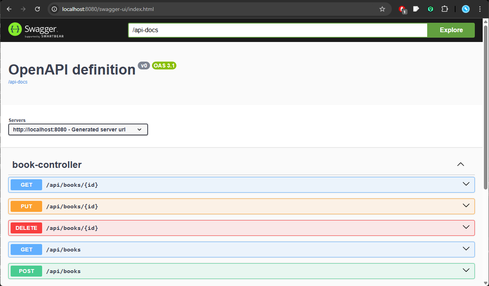

# API REST de Gerenciamento de Livros - Desafio Java [NTConsult](https://ntconsult.com.br/)

**LinkedIn:** https://www.linkedin.com/in/mardoniorodrigues/

**E-mail:** mardoniorodrigues11@gmail.com

## Sobre o Projeto

Este projeto consiste em uma API REST para gerenciamento de livros. A API permite realizar operações CRUD para a entidade Book, oferecendo endpoints para listar todos os livros, buscar livros por ID, criar novos livros, atualizar livros existentes e excluir livros.

## Tecnologias Utilizadas
- **Java 21**
- **Spring Boot 3.4.4**
- **Spring Data JPA**
- **Spring Validation**
- **Swagger/OpenAPI**
- **JUnit 5**
- **Mockito**
- **Maven**
- **H2 Database**

## Estrutura do Projeto
```
src/
├── main/
│   ├── java/
│   │   └── br/com/ntconsult/rest_api_books/
│   │       ├── RestApiBooksApplication.java
│   │       ├── controller/
│   │       │   ├── BookController.java
│   │       │   └── common/
│   │       │       └── GlobalExceptionHandler.java
│   │       ├── dto/
│   │       │   └── BookDTO.java
│   │       │   └── FieldErrorDetailDTO.java
│   │       │   └── ResponseErrorDTO.java
│   │       ├── model/
│   │       │   └── Book.java
│   │       ├── repository/
│   │       │   └── BookRepository.java
│   │       │   └── specs/
│   │       │       └── BookSpecification.java
│   │       └── service/
│   │           └── BookService.java
│   └── resources/
│       ├── application.properties
└── test/
    └── java/
        └── br/com/ntconsult/rest_api_books/
            └── BookControllerTest.java
```

## Entidades
### Book
A entidade do sistema possui os seguintes atributos:

```java
Long id;
String title;
String author;
Integer publishYear;
```

## Endpoints
A API oferece os seguintes endpoints:

| Método | URL | Descrição |
|--------|-----|-----------|
| GET | `/api/books` | Retorna todos os livros cadastrados |
| GET | `/api/books/{id}` | Retorna um livro específico pelo ID |
| POST | `/api/books` | Cria um novo livro |
| PUT | `/api/books/{id}` | Atualiza um livro existente |
| DELETE | `/api/books/{id}` | Remove um livro |

### Exemplos de Requisições

#### Listar todos os livros
```
GET /api/books
```

Resposta:
```json
[
  {
    "id": 1,
    "title": "Clean Code",
    "author": "Robert C. Martin",
    "publishYear": 2008
  }
]
```

#### Buscar livro por ID
```
GET /api/books/1
```

Resposta:
```json
{
  "id": 1,
  "title": "Clean Code",
  "author": "Robert C. Martin",
  "publishYear": 2008
}
```

#### Criar um novo livro
```
POST /api/books
Content-Type: application/json

{
  "title": "Refactoring",
  "author": "Martin Fowler",
  "publishYear": 1999
}
```

Resposta:
```json
{
  "id": 3,
  "title": "Refactoring",
  "author": "Martin Fowler",
  "publishYear": 1999
}
```

#### Atualizar um livro
```
PUT /api/books/3
Content-Type: application/json

{
  "title": "Refactoring: Improving the Design of Existing Code",
  "author": "Martin Fowler",
  "publishYear": 1999
}
```

Resposta:
```json
{
  "id": 3,
  "title": "Refactoring: Improving the Design of Existing Code",
  "author": "Martin Fowler",
  "publishYear": 1999
}
```

#### Remover um livro
```
DELETE /api/books/3
```

Resposta: Status 204 No Content

## Validações
Foram implementadas validações para garantir a integridade dos dados nas operações de criação e atualização:

- **title**: Não pode ser nulo ou vazio. Mínimo 2 caracteres, máximo 150.
- **author**: Não pode ser nulo ou vazio. Mínimo 2 caracteres, máximo 100.
- **publishYear**: Não pode ser nulo. Valor mínimo 1600, valor máximo 2025.

## Tratamento de Exceções
Foi implementada uma classe `GlobalExceptionHandler` com a anotação `@RestControllerAdvice` para tratar exceção personalizada de validações.

- **ValidationException**: Retorna status 422 (Unprocessable Entity) com detalhes dos campos inválidos

```json
{
    "status": 422,
    "message": "Validation Failed",
    "fieldErrors": [
        {
            "field": "publishYear",
            "error": "The field cannot be null."
        },
        {
            "field": "title",
            "error": "field outside the standard size"
        },
        {
            "field": "author",
            "error": "field outside the standard size"
        }
    ]
}
```


## Documentação da API
A documentação da API foi implementada utilizando Swagger e está disponível no endpoint:

```
/docs.html
```

A documentação inclui todos os endpoints disponíveis, modelos de dados, parâmetros necessários e possíveis respostas.



## Testes
Foram implementados testes unitários completos para a camada de controller, verificando o comportamento de todos os endpoints da API.

Os testes cobrem os seguintes cenários:

- **getAllBooks_ReturnsBookPage**: Verifica se a API retorna uma página de livros corretamente quando são fornecidos parâmetros de filtragem (título, autor, ano de publicação) e paginação.
- **getBookById_ExistingId_ReturnsBook**: Verifica se a API retorna o livro correto quando é fornecido um ID existente.
- **getBookById_NonExistingId_ReturnsNotFound**: Verifica se a API retorna status 404 (Not Found) quando um ID inexistente é solicitado.
- **createBook_ValidBook_ReturnsCreated**: Verifica se a API cria corretamente um novo livro com dados válidos e retorna status 201 (Created) com o header Location.
- **updateBook_ExistingId_ReturnsUpdatedBook**: Verifica se a API atualiza corretamente um livro existente e retorna os dados atualizados.
- **updateBook_NonExistingId_ReturnsNotFound**: Verifica se a API retorna status 404 (Not Found) quando tenta atualizar um livro inexistente.
- **deleteBook_ExistingId_ReturnsNoContent**: Verifica se a API remove corretamente um livro existente e retorna status 204 (No Content).
- **deleteBook_NonExistingId_ReturnsNotFound**: Verifica se a API retorna status 404 (Not Found) quando tenta remover um livro inexistente.

## Como Executar

### Pré-requisitos
- Java 21 instalado
- Maven instalado

### Passos para execução
1. Clone o repositório:
```bash
git clone https://github.com/MardonioEng/desafio-java-ntconsult
cd rest-api-books
```

2. Compile e execute o projeto:
```bash
mvn clean install
mvn spring-boot:run
```

3. A aplicação estará disponível em:
```
http://localhost:8080
```

4. A documentação Swagger estará disponível em:
```
http://localhost:8080/docs.html
```

## Como Testar

### Executando os testes
```bash
mvn test
```

